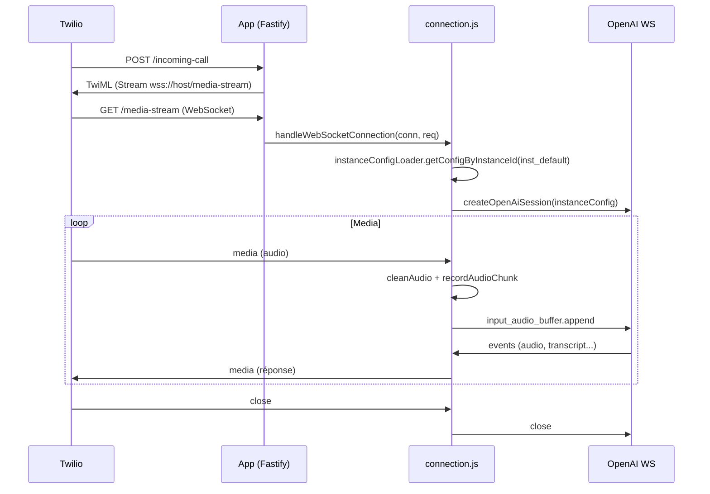
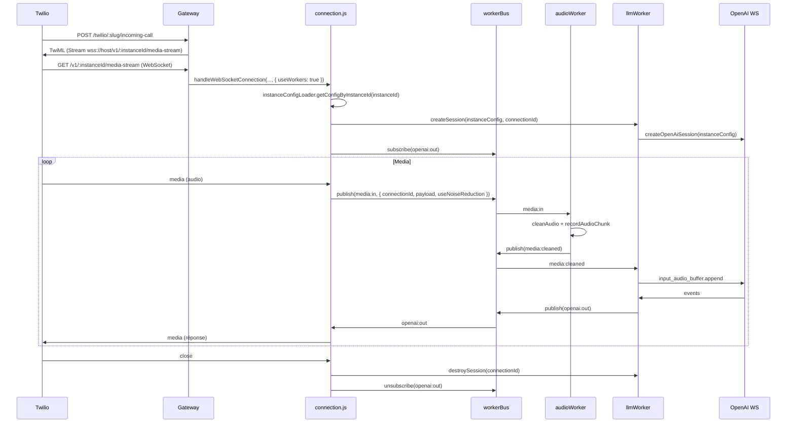

# Compte rendu des implémentations - Backend vocal SaaS multi-tenant

Document de synthèse des phases 1 à 5 et guide pour comprendre le système.

---

## 1. Vue d'ensemble

Le backend vocal (Twilio + OpenAI Realtime) a été migré vers une architecture **SaaS multi-tenant** en plusieurs phases. Chaque **instance** représente un client (ex. un restaurant) avec sa propre configuration : tarifs, numéros Twilio, clé OpenAI, voix, option RNNoise.

- **Application principale** (`server.js` + `app.js`) : API REST (commandes, réservations, pricing, auth) + route WebSocket `/media-stream` et webhook `/incoming-call` en mode **monolithique** (tout dans le même processus).
- **Gateway vocal** (`gateway.js`) : serveur léger dédié aux appels (routes Twilio + WebSocket par instance), avec **workers** (bus in-memory, audioWorker, llmWorker) pour le traitement audio et LLM.

---

## 2. Phases réalisées

### Phase 1 – Modèles SaaS et API

| Élément | Détail |
|--------|--------|
| **Instance** | `backend/storage/models/Instance.js` : `instanceId`, `slug`, `plan`, `status`, `twilioNumbers`, `openAi` (apiKey, model, voice), `audio.enableNoiseReduction`. |
| **ApiKey** | `backend/storage/models/ApiKey.js` : `instanceId`, `keyHash`, `label`, `scopes`, `revokedAt`. Clé stockée hashée (PBKDF2). |
| **instanceId sur les modèles** | Champ optionnel indexé sur : Pricing, Order, Reservation, Client, CallMonitor, ClientQuota, User. Unicité par tenant (ex. Client sur `(instanceId, telephone)`). |
| **Backfill** | `backend/scripts/backfillInstanceId.js` : crée l’instance par défaut `inst_default` (slug `default`) et met à jour les documents existants. À lancer depuis `backend/` : `node scripts/backfillInstanceId.js`. |
| **Routes** | `backend/API/routes/instances.js` (GET/POST instances), `backend/API/routes/apiKeys.js` (POST/GET/PATCH api-keys). Enregistrées sous le bloc protégé par clé API dans `app.js`. |

### Phase 2 – Middleware et services par instance

| Élément | Détail |
|--------|--------|
| **Auth multi-tenant** | `backend/API/middleware/multiTenantAuth.js` : lit `x-api-key` ou `api_key`, appelle `ApiKeyService.validate` ou accepte `process.env.X_API_KEY` (rétrocompat), attache `request.instanceId`. |
| **Services** | Tous les services métier acceptent un `instanceId` (défaut `inst_default`) et filtrent en base : PricingService, PhoneLineService, ProductService, callMinutesService, ProcessCallService, OrderService, etc. |
| **Contrôleurs** | Passent `request.instanceId || "inst_default"` (ou équivalent) aux services. La route processCall et le webhook Twilio `/incoming-call` utilisent l’instance appropriée. |

### Phase 3 – Config Loader et OpenAI par instance

| Élément | Détail |
|--------|--------|
| **instanceConfigLoader** | `backend/Config/instanceConfigLoader.js` : agrège Instance + Pricing + prompts pour une instance. |
| **getConfigByInstanceId(instanceId)** | Charge Instance (active) + Pricing, construit le prompt enrichi (getSystemMessage + generateEnrichedPromptWithPricing), appelle getSessionUpdatePayload(voice, instructions), retourne une config runtime : `openAi` (apiKey, model, voice, sessionUpdatePayload), `audio.enableNoiseReduction`, `restaurantInfo`, `pricing`, `callLogger`. Cache TTL 60 s. |
| **getInstanceByApiKey(rawKey)** | Valide la clé via ApiKeyService, charge l’instance, retourne `{ instanceId, instance }`. |
| **pricingService (GPT)** | `backend/Services/gptServices/pricingService.js` : `buildGptPricingFromDoc(pricing)`, `generateEnrichedPromptWithPricing(basePrompt, pricing)`, `getPricingForGPT(instanceId)`, `generateEnrichedPrompt(basePrompt, instanceId)`. |
| **gptServices** | `backend/Services/gptServices/gptServices.js` : `getSessionUpdatePayload(voice, instructions)` construit l’objet session (VAD, tools, transcription, etc.) sans BDD ; `createOpenAiSession(instanceConfig)` utilise `instanceConfig.openAi.apiKey`, `.model`, `.sessionUpdatePayload` et n’accède plus à la BDD ni à `process.env` dans la session. |
| **connection.js** | Utilise `instanceConfigLoader.getConfigByInstanceId(resolvedInstanceId)` et `createOpenAiSession(instanceConfig)` ; option RNNoise pilotée par `instanceConfig.audio.enableNoiseReduction`. |

### Phase 4 – Gateway et workers

| Élément | Détail |
|--------|--------|
| **workerBus** | `backend/workers/workerBus.js` : bus in-memory `subscribe(topic, handler)` / `publish(topic, data)`. Topics : `media:in`, `media:cleaned`, `openai:in`, `openai:out`. |
| **audioWorker** | `backend/workers/audioWorker.js` : s’abonne à `media:in` (`streamSid`, `payload`, `useNoiseReduction`), appelle cleanAudio si besoin + recordAudioChunk, publie `media:cleaned`. |
| **llmWorker** | `backend/workers/llmWorker.js` : `createSession(instanceConfig, streamSid)`, `sendAudio(streamSid, payload)`, `send(streamSid, data)` pour commandes OpenAI, `destroySession(streamSid)` ; s’abonne à `media:cleaned` et `openai:in`. |
| **Gateway** | `backend/gateway.js` : Fastify sur port `GATEWAY_PORT` (défaut 3001). Routes : `POST /twilio/:slug/incoming-call`, `GET /v1/:instanceId/media-stream` (WebSocket). Au démarrage : startAudioWorker(), startLlmWorker(). |
| **Twilio** | `generateTwiml(host, streamPath)` dans `backend/Services/twilioServices/twilioServices.js` : `streamPath` optionnel (défaut `/media-stream`). Le Gateway utilise `/v1/${instanceId}/media-stream`. |

### Phase 5 – Connection.js et mode workers

| Élément | Détail |
|--------|--------|
| **Option useWorkers** | `handleWebSocketConnection(connection, request, instanceId, options)` : si `options.useWorkers === true`, la connexion passe par le bus et les workers. |
| **Mode workers** | Un `connectionId` stable est généré ; session créée via llmWorker ; un **proxy** remplace le WebSocket OpenAI (send → publish `openai:in`) ; abonnement à `openai:out` pour alimenter OpenAIHandler ; événements `media` → publish `media:in` ; à la fermeture : destroySession + unsubscribe. |
| **Mode monolith** | Comportement inchangé : createOpenAiSession direct, cleanAudio/record dans connection.js, openAiWs.on("message"). |
| **Gateway** | Appelle `handleWebSocketConnection(..., { useWorkers: true })`. |

---

## 3. Fichiers clés et rôles

| Fichier | Rôle |
|---------|------|
| `server.js` | Point d’entrée : charge `app.js`, écoute sur le port configuré. |
| `app.js` | Fastify : CORS, WebSocket, routes (calls, ws, API protégée par multiTenantAuth). Ne lance pas le Gateway. |
| `gateway.js` | Serveur vocal dédié : DB, CORS, WebSocket, routes Twilio + media-stream, démarre les workers. Script npm : `pnpm run gateway`. |
| `Config/instanceConfigLoader.js` | Chargeur de config par instance (Instance + Pricing + prompts), cache TTL, getInstanceByApiKey. |
| `Websocket/connection.js` | Gestion d’une connexion Twilio : instanceConfig, création session OpenAI (directe ou via llmWorker), handlers Twilio/OpenAI, media → inline ou bus. |
| `Services/gptServices/gptServices.js` | getSessionUpdatePayload, createOpenAiSession(instanceConfig), constantes (tools, transcription prompt). |
| `Services/gptServices/pricingService.js` | getPricingForGPT(instanceId), buildGptPricingFromDoc, generateEnrichedPromptWithPricing, generateEnrichedPrompt. |
| `workers/workerBus.js` | Bus in-memory (subscribe/publish). |
| `workers/audioWorker.js` | Traitement media:in → cleanAudio + record → media:cleaned. |
| `workers/llmWorker.js` | Sessions OpenAI par streamSid, media:cleaned → OpenAI, openai:in → OpenAI, réponses → openai:out. |
| `storage/models/Instance.js` | Schéma instance (instanceId, slug, openAi, audio, etc.). |
| `storage/models/ApiKey.js` | Schéma clé API (instanceId, keyHash, scopes). |
| `API/services/ApiKeyService.js` | Validation clé (PBKDF2), createForInstance. |
| `API/middleware/multiTenantAuth.js` | Vérification clé API, attache request.instanceId. |
| `Routes/Ws/ws.js` | Route GET `/media-stream` (app principale), appelle handleWebSocketConnection sans useWorkers. |
| `Routes/Calls/call.js` | Route `/incoming-call` (app principale), instance par défaut. |

---

## 4. Flux de données

### 4.1 Appel entrant via le Gateway (mode workers)

1. **Twilio** appelle le webhook `POST /twilio/:slug/incoming-call` sur le Gateway.
2. Gateway : résolution `slug` → instance (InstanceModel), vérification ligne (PricingService, PhoneLineService), renvoie TwiML avec `Stream url="wss://host/v1/{instanceId}/media-stream"`.
3. **Twilio** ouvre une WebSocket vers `GET /v1/:instanceId/media-stream` sur le Gateway.
4. Gateway : `handleWebSocketConnection(connection, request, instanceId, { useWorkers: true })`.
5. **connection.js** : charge config (instanceConfigLoader), génère `connectionId`, llmWorker.createSession(instanceConfig, connectionId), s’abonne à openai:out, crée le proxy openAiWs.
6. **Messages media** Twilio : connection publie `media:in` (connectionId, payload, useNoiseReduction).
7. **audioWorker** : reçoit media:in, cleanAudio + record, publie `media:cleaned`.
8. **llmWorker** : reçoit media:cleaned, sendAudio(connectionId, payload) vers OpenAI.
9. **OpenAI** renvoie des événements (audio, transcript, etc.) ; llmWorker publie `openai:out`.
10. **connection.js** (abonné à openai:out) : openAIHandler.handleMessage(data) → envoi audio/événements vers la connexion Twilio.
11. Commandes vers OpenAI (ex. response.create 4 min) : handlers font openAiWs.send(...) → proxy publie `openai:in` → llmWorker envoie au WebSocket OpenAI.
12. À la fermeture : destroySession(connectionId), unsubscribe openai:out.

### 4.2 Appel entrant via l’app principale (mode monolith)

1. Twilio appelle `POST /incoming-call` (route call.js), TwiML pointe vers `wss://host/media-stream`.
2. WebSocket `GET /media-stream` (ws.js) : handleWebSocketConnection(connection, request) sans 4e argument → useWorkers faux.
3. connection.js : createOpenAiSession(instanceConfig) direct, cleanAudio + record + openAiWs.send dans le même processus, openAiWs.on("message") → openAIHandler.handleMessage.

### 4.3 API REST et multi-tenant

- Requêtes avec en-tête `x-api-key` (ou `api_key`) : multiTenantAuth valide la clé, attache `request.instanceId`. Les contrôleurs passent cet `instanceId` aux services (Pricing, Order, etc.) qui filtrent les requêtes Mongo par instance.

---

## 5. Configuration et variables d’environnement

| Variable | Usage |
|----------|--------|
| `MONGO_URI` | Connexion MongoDB (app + Gateway). |
| `OPENAI_API_KEY` | Clé OpenAI globale (fallback si l’instance n’a pas de clé). |
| `X_API_KEY` | Clé API optionnelle pour rétrocompat (multiTenantAuth). |
| `GATEWAY_PORT` | Port du Gateway (défaut 3001). |
| `VOICE_GATEWAY_PUBLIC_HOST` | Host public du Gateway pour les URLs TwiML (sinon Host de la requête). |
| `PUBLIC_HOST` / `VOICE_GATEWAY_PUBLIC_HOST` | Utilisés dans les réponses de création d’instance (URLs webhook et WebSocket). |

---

## 6. Lancer le système

- **Application principale** (API + media-stream monolith) : depuis `backend/` : `pnpm run dev` ou `pnpm start` (selon server.js).
- **Gateway vocal** (Twilio + workers) : depuis `backend/` : `pnpm run gateway`. Même `.env` (MONGO_URI, etc.) ; port distinct (ex. 3001).
- **Backfill instance** (une fois) : `node scripts/backfillInstanceId.js`.

Pour que Twilio utilise le Gateway : configurer le webhook du numéro vers `https://<VOICE_GATEWAY_PUBLIC_HOST>/twilio/<slug>/incoming-call` (slug de l’instance). Le TwiML renverra alors l’URL de stream vers le Gateway.

---

## 7. Sécurité

### Clés API

- **Stockage** : Les clés API (accès à l’API REST) sont hashées en base (PBKDF2, `ApiKeyModel.keyHash`). La clé brute n’est jamais stockée et n’est retournée qu’**une seule fois** à la création (POST `/api/instances/:instanceId/api-keys`). Ne pas logger le corps de cette réponse.
- **OpenAI** : La clé OpenAI peut être définie par instance (`Instance.openAi.apiKey`) ou via `OPENAI_API_KEY` en fallback. En production, restreindre l’accès au modèle Instance et éviter de logger tout objet contenant `apiKey` ou `openAi`.
- **Logs** : Le logger (`Services/logging/logger.js`) redacte les champs sensibles (`apiKey`, `api_key`, `authorization`, `password`, `token`, `secret`) dans les meta passés aux logs : ils sont remplacés par `[REDACTED]`.
- **Salt** : Utiliser `API_KEY_SALT` en production (défaut `change_me_in_production`) pour le hash PBKDF2 des clés API.

### Rotation des clés

- **Révocation** : PATCH `/api/instances/:instanceId/api-keys/:keyId` avec `{ "revoked": true }` invalide une clé (champ `revokedAt`).
- **Nouvelle clé** : POST `/api/instances/:instanceId/api-keys` crée une nouvelle clé ; l’ancienne peut rester révoquée. Recommandation : politique de rotation régulière (ex. tous les 90 jours) et révocation des clés inutilisées.

---

## 8. Cache instanceConfigLoader

- **TTL** : 60 secondes par défaut (`TTL_MS`).
- **Invalidation** : `instanceConfigLoader.invalidate(instanceId)` vide l’entrée cache pour une instance. À appeler après toute modification qui impacte la config utilisée en appel (voix, pricing, instructions, clé OpenAI) :
  - Après mise à jour d’une **Instance** (ex. PATCH openAi.voice, openAi.apiKey) ;
  - Après mise à jour du **Pricing** d’une instance (menu, horaires, restaurantInfo).
- Aujourd’hui il n’y a pas de route PATCH instance dans l’API ; dès qu’une telle route ou toute route/metier qui met à jour Instance ou Pricing existera, elle doit appeler `instanceConfigLoader.invalidate(instanceId)` après l’écriture en base.

---

## 9. URLs et cohabitation Monolithique / Gateway

Pour éviter toute confusion sur quelle URL utiliser :

| Mode | Webhook entrée d’appel | URL WebSocket media stream | Qui utilise |
|------|------------------------|----------------------------|-------------|
| **Monolithique** | `POST /incoming-call` (app principale) | `wss://<host>/media-stream` | Twilio si le webhook du numéro pointe vers l’app principale. Une seule instance implicite (`inst_default`). |
| **Gateway** | `POST /twilio/:slug/incoming-call` (Gateway) | `wss://<host>/v1/:instanceId/media-stream` | Twilio si le webhook pointe vers le Gateway. Une URL par instance ; l’instance est identifiée par le slug (webhook) puis par l’instanceId dans le chemin du stream. |

- **Ne pas mélanger** : un même numéro Twilio doit pointer soit vers l’app principale (webhook → `/incoming-call`), soit vers le Gateway (webhook → `/twilio/<slug>/incoming-call`). Le TwiML renvoyé contient l’URL de stream correspondante.
- **Multi-tenant même numéro** : Twilio associe un numéro à un seul webhook. Pour plusieurs instances sur un même numéro, il faudrait un dispatcher unique (ex. un seul webhook qui route selon un critère) ; ce n’est pas implémenté par défaut.

---

## 10. Phase 8 – Suppression des routes monolithiques

Quand **toutes** les instances passent par le Gateway (webhooks Twilio configurés vers le Gateway, plus aucun usage de `/incoming-call` et `/media-stream` de l’app principale) :

- Supprimer ou désactiver la route **GET /media-stream** (`Routes/Ws/ws.js`) et la route **POST /incoming-call** (`Routes/Calls/call.js`) de l’app principale.
- Optionnel : retirer l’enregistrement WebSocket de l’app si plus aucun usage.
- Documenter que l’entrée vocale est uniquement via le Gateway (port `GATEWAY_PORT`).

---

## 11. Tests recommandés

- **Bus et workers** : Test de charge du bus in-memory et des workers (nombre de connexions simultanées, débit media:in/media:cleaned/openai:in/openai:out) pour vérifier l’absence de goulot d’étranglement et de fuites (sessions non détruites, abonnements non libérés).
- **Multi-tenant** : Vérifier le comportement lorsque plusieurs instances sont actives (appels simultanés sur des instances différentes, isolation des configs et des sessions LLM). Si un même numéro Twilio est partagé entre instances (via un dispatcher), tester le routage et l’isolation.

---

## 12. Logs et monitoring

- **instanceId dans les logs** : Les événements clés du cycle d’appel (démarrage, fin, erreur fatale) incluent `instanceId` dans les meta (ex. `callLogger.callStarted(..., { instanceId })`, `callCompleted(..., instanceId)`, `callLogger.error(..., { instanceId })`). Permet de filtrer les logs par instance (ex. `grep instanceId logs/calls.log`).
- **Sessions OpenAI et workers** : À superviser : fermeture propre des sessions (destroySession à la fermeture de la connexion Twilio), absence de crash non géré dans les handlers du bus, timeouts éventuels (ex. 4 min / 5 min d’appel). En cas de crash du processus Gateway, les sessions in-memory sont perdues ; prévoir redémarrage automatique et éventuellement métriques (nombre de sessions actives, nombre de messages par topic).

---

## 13. Schémas du flux de données

### 13.1 Mode monolithique (app principale)

### 13.2 Mode Gateway + workers

---

## 14. Phases restantes (6–8)

- **Phase 6** : Faire pointer Twilio (webhooks) vers le Gateway en production.
- **Phase 7** : Renforcer le multi-tenant (création d’instances, rotation/révocation des clés), idempotence des webhooks.
- **Phase 8** : Voir section 10 (suppression routes monolithiques si tout passe par le Gateway), secrets globaux, tests de charge.

---

## 15. Résumé

Le système permet aujourd’hui :

- Plusieurs **tenants** (instances) avec pricing, lignes et config OpenAI distincts.
- **Deux points d’entrée** : app principale (monolith) et Gateway (workers) ; le Gateway utilise le bus et les workers pour l’audio et le LLM.
- **Config centralisée** par instance via instanceConfigLoader (cache 60 s) ; plus d’accès BDD direct dans createOpenAiSession.
- **Compatibilité** : l’app actuelle continue de fonctionner sans modifier les URLs ; le Gateway est prêt pour un basculement progressif (Phases 6–8).

Ce document sert de référence pour l’implémentation actuelle et la compréhension du flux vocal multi-tenant.
